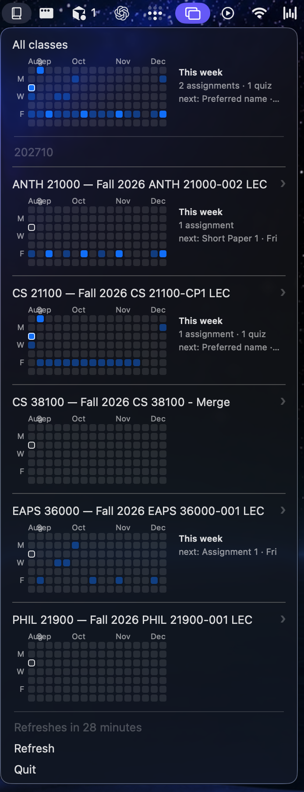

# Brightspace Bar 📅 — No More Login. No More Friction.

[](https://github.com/DavidChen-006/Brightspace-Bar/actions/workflows/ci.yml)
[](https://github.com/DavidChen-006/Brightspace-Bar/releases/latest)


[](LICENSE)

A macOS menu-bar app for Brightspace (D2L): your courses, a GitHub-style
due-date heatmap per class, and one-click deep links that land already signed
in — without your credentials ever touching the app.



## What it does

- **A heatmap per course** — each current course is a row with a
  GitHub-contributions-style grid of the coming weeks: darker squares mean
  heavier work (assignment < quiz < test), today is outlined.
- **An "All classes" aggregate** on top, folding every course's grid into one.
- **Hover a day, see the work** — a popup lists that day's items; clicking one
  opens it in a persistent, already-signed-in Chromium (each click adds a tab).
- **"This week" at a glance** — per-course counts and the next due item, right
  beside the grid.
- **Your own items** — add assignments/quizzes/tests with a date picker from
  each course's submenu; they render in the grid like fetched ones and delete
  with an ✕ from the popup.
- **Background refresh** every 30 minutes, silently, via a session the app
  never sees.

## How it stays safe

The app is two halves with a deliberate wall between them:

- A **Swift menu-bar app** that renders cached JSON. It contains no network
  code and no credentials — it cannot log in *by construction*.
- A **Node daemon** (`session-capture/`) that owns the browser session: a
  one-time interactive login into a persistent Chromium profile, then silent
  cookie/JWT renewal on a ladder that only escalates as far as it must.

Your email and password are typed once, by you, into Microsoft's real login
page in a real browser window. They are never stored by this project, never
logged, and never cross into the Swift process (invariant **D7**). The app
only ever spawns the daemon in its non-interactive mode (invariant **D8**).

## Supported

- macOS 14+
- Xcode Command Line Tools with Swift 6.2+ (`xcode-select --install`)
- Node 20+ (`brew install node`)
- Purdue Brightspace via Entra specifically — the SAML entityId is
  Purdue-hardcoded today; PRs generalising it are welcome.

This is a build-from-source app today — no binary release yet. The latest
tagged state is
[`v0.1.0`](https://github.com/DavidChen-006/Brightspace-Bar/releases/tag/v0.1.0).

## Quick Start

```sh
git clone https://github.com/DavidChen-006/Brightspace-Bar.git
cd BrightspaceBar
make setup    # checks prerequisites, installs the daemon's dependencies
make start    # THE one command — see below
```

`make start` does everything: it builds the app, prompts for your credentials
in the terminal on first run, launches the menu bar, and performs the headless
login — no browser window; the MFA verification number appears **on the
menu-bar icon**, you type it into Authenticator on your phone, and the icon
reverts. After that, the daemon refreshes the session silently for weeks. If
courses ever stop refreshing, run `make start` again.

Day to day, `make start` is only needed once — and again whenever the session
needs a fresh login. If you've quit the app and just want it back, `make run`
is the "reopen" gesture: build and launch, nothing else (there's no `.app`
bundle to double-click yet). A third target, `make login`, runs the
interactive Chromium login alone.

### Environment configuration

See [`session-capture/.env.example`](session-capture/.env.example) for the
knobs. Normally you never touch env vars: credentials are entered once via the
`make start` prompt and stored with mode 0600 under
`~/Library/Application Support/BrightspaceBar` — never in the repo. When
`BS_EMAIL` and `BS_PASSWORD` are both set in the environment, they override
the stored file.

## Project layout

| Path | What it is |
| --- | --- |
| `BrightspaceBar/` | The Swift package: the menu-bar app and its modules (`Modules/<Name>/`), tests included |
| `session-capture/` | The Node daemon: login ladder, data fetch, deep-link opener |
| `docs/` | Design documents |

The numbered `experiment-*` probes that de-risked each design decision live on
the [`experiments` branch](https://github.com/DavidChen-006/Brightspace-Bar/tree/experiments/experiments)
— kept as engineering notes, off the main tree.

## Architecture

The deep dive lives in [docs/architecture.md](docs/architecture.md) and
[BrightspaceBar/ARCHITECTURE.md](BrightspaceBar/ARCHITECTURE.md). The short
version, enforced by tests: the GUI imports only the `CourseMenu` contract
module; adapters translate between pipelines and the menu model; the
composition root is `main.swift`. See [CONTRIBUTING.md](CONTRIBUTING.md).

Looking for something to pick up? The
[open issues](https://github.com/DavidChen-006/BrightspaceBar/issues) include
`good first issue`s with acceptance criteria spelled out.

## Development

```sh
make -C BrightspaceBar build  # build the Swift app (or: cd BrightspaceBar && swift build)
make test                     # full suite, from the repo root
make -C BrightspaceBar run    # run the app from source
```

## License

[MIT](LICENSE). Not affiliated with Purdue University or D2L Corporation;
Brightspace is a trademark of D2L.
